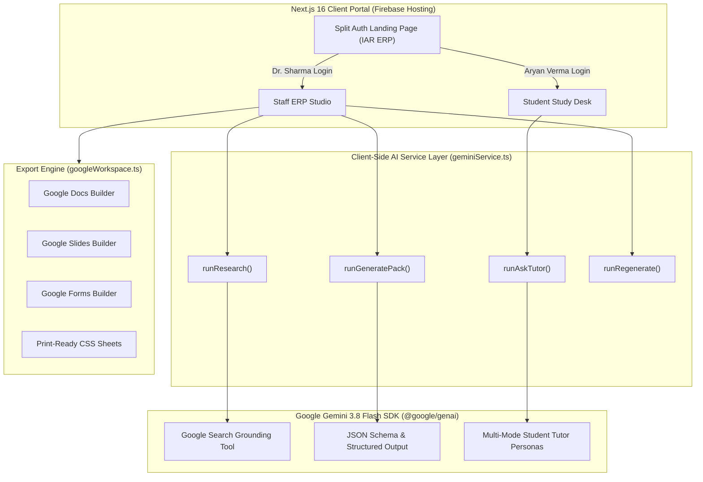

<div align="center">

# 🎓 Kaksha.ai (कक्षा.ai)
### **The Autonomous Academic ERP & AI Teaching Studio**
*Bridging Faculty Preparation, Live Lecture Delivery, and Student Comprehension via Gemini 3.8 Flash & Google Search Grounding.*

[](https://kaksha-ai-portal.web.app)
[](https://nextjs.org/)
[](https://ai.google.dev/)
[](https://www.typescriptlang.org/)
[](https://tailwindcss.com/)
[](https://opensource.org/licenses/MIT)

<br/>

**[Explore Live Demo →](https://kaksha-ai-portal.web.app)** • **[Staff Portal](https://kaksha-ai-portal.web.app)** • **[Student Desk](https://kaksha-ai-portal.web.app)** • **[Architecture](#-system-architecture)** • **[Quickstart](#-quickstart)**

---

</div>

## 🌟 Overview & Philosophy

Traditional university ERPs are glorified administrative filing cabinets — tracking attendance percentages, fees, and marks, yet doing nothing to improve actual **teaching quality** or **student understanding**.

Teachers spend **10 to 15 hours every week** manually scouting research papers, crafting presentation slides, writing tiered worksheets, and assembling exam-aligned quizzes. Meanwhile, students sit in lecture halls overwhelmed by dense slides, turning to generic LLMs that give confusing, non-curriculum answers detached from what their professor taught that morning.

**Kaksha.ai** closes this loop with an end-to-end pedagogical engine:

```
┌──────────────┐     ┌──────────────┐     ┌──────────────┐     ┌──────────────┐
│ 1. RESEARCH  │ ──> │   2. PLAN    │ ──> │  3. PREPARE  │ ──> │   4. TEACH   │
│ Grounded Web │     │ Time-Boxed   │     │ Slides, Quiz │     │ Live Prompt  │
│ & ArXiv Data │     │ Pedagogy Map │     │ & Worksheets │     │ & AI Copilot │
└──────────────┘     └──────────────┘     └──────────────┘     └──────────────┘
                                                                       │
┌──────────────┐     ┌──────────────┐     ┌──────────────┐             │
│  7. IMPROVE  │ <── │  6. ASSESS   │ <── │   5. LEARN   │ <───────────┘
│ 1-Click 15m  │     │ Class Weak   │     │ Plain-English│
│ Remedial Pack│     │ Topic Radar  │     │ AI Study Desk│
└──────────────┘     └──────────────┘     └──────────────┘
```

---

## ✨ Key Features

### 🏛️ 1. Institutional Split-Screen Landing & Campus ERP
- **Collegiate Warm Off-White / Beige Palette (`#fbf9f5`, `#f5f2eb`)**: Designed to reflect real academic environments with deep maroon, academic teal, and crisp typography.
- **Split-Screen Authentication**: Campus academic block photography on the left with university accreditation badges; institutional GNUMS authentication card on the right.
- **Faculty Onboarding**: Dedicated staff registration with Staff Code / Emp ID, academic department, academic title (Dr./Prof.), and faculty certification.
- **Student Enrollment**: Student registration with University Enrollment Number / PRN, degree program, and semester selection.
- **1-Click Evaluator Personas**: Pre-configured demo logins for **Dr. Ananya Sharma** (Faculty) and **Aryan Verma** (Student) for instant evaluation.

---

### 🔬 2. Autonomous Research Engine (Gemini 3.8 Flash + Google Search Grounding)
- **Live Academic Grounding**: Queries Google Search Grounding to extract the newest scientific papers, syllabus standards, Stanford/MIT lecture notes, and video tutorials.
- **Source Trust Scoring**: Classifies and scores sources across Academic Papers, Video Tutorials, Official Documentation, and Interactive Demos with direct URLs.
- **"Ask Your Sources" Drawer**: Faculty can inspect extracted citations, verify claims, and ask grounded questions before lesson preparation begins.

---

### 📦 3. Complete AI Classroom Pack Generation
Generates a complete, ready-to-teach curriculum package in seconds:
- ⏱️ **60-Minute Lesson Timeline**: 8 structured pedagogical blocks (Hook, Concept Intro, Interactive Demo, Worked Example, Hands-on Activity, Class Discussion, Formative Quiz, Exit Ticket).
- 📊 **13-Slide Full Presentation Deck**: Slide titles, key bullet points, presenter delivery cues, visual diagram prompts, and discussion questions.
- 📝 **3-Tier Differentiated Student Worksheet**: Foundation (Recall), Standard (Application), and Challenge (Open Analysis) sections.
- 🎯 **5-Question Diagnostic Quiz**: Curriculum-matched MCQs with Bloom's Taxonomy tags (`Recall`, `Understanding`, `Application`, `Analysis`), full explanations, and distractor rationales.
- 🎙️ **5-Minute Teacher Audio Briefing**: Concise verbal summary script, key lecture analogies, and classroom delivery warnings.
- 💡 **4 Misconceptions Clarified**: Common student traps and exact scientific explanations to preempt confusion.
- 🤝 **Physical Classroom Activity**: Complete human-filter interactive group exercise guide.

---

### 📤 4. Google Workspace 1-Click Export
- **Google Docs API Payload**: Formatted syllabus-ready lesson plan and tiered worksheet.
- **Google Slides API Payload**: Complete 13-slide deck exportable directly into Google Slides.
- **Google Forms API Schema**: Formative quiz exportable with auto-marking answer keys.
- **Printable Worksheet (HTML/CSS)**: Clean, print-ready document formatted for physical paper distribution.

---

### 👨‍🏫 5. Live Classroom Teach Mode (Teleprompter HUD)
- **Classroom Teleprompter**: Fullscreen presentation view with live elapsed time, pacing warnings, and slide-synced teacher cue cards.
- **AI Classroom Copilot**: Real-time faculty assistant during live lectures to generate instant analogies, answer unexpected student questions, and provide quick math clarifications.
- **Dual Display Modes**: Toggle between **Warm Beige Classroom** and **High-Contrast Dark Auditorium HUD**.

---

### 👨‍🎓 6. Student Study Desk & "Student Understanding" UI
Tailored specifically for student clarity and stress-free learning:
- 💡 **30-Second Plain-English Breakdown**: Complex topics explained without academic jargon (e.g., Convolutional Neural Networks explained via the *magnifying glass with a flashlight* analogy).
- 🎯 **3-Step Clear Action Plan**: Guides the student step-by-step (Review Notes → Practice 5 Questions → Ask AI Buddy).
- 🧮 **Interactive Formula Playground**: Real-time visual parameter calculator for feature map output dimensions:
  $$\text{Output Size} = \left\lfloor \frac{W - K + 2P}{S} \right\rfloor + 1$$
  Students adjust $W, K, P, S$ sliders and immediately see the spatial resolution compute with auto "Same" padding warnings.
- ⚠️ **3 Common Exam Traps**: Explicit callouts on standard test mistakes (e.g., *Pooling layers contain ZERO learnable weights!*).
- 📖 **Slide-by-Slide Lecture Hub**: Review lecture slides with accompanying plain-English explanations and one-click *"Explain this slide"* hooks.
- 📝 **Self-Paced Practice Quiz**: Real-time scoring, confetti celebrations, and instant *"💡 Why this is correct"* rationales.
- 🤖 **Student AI Study Buddy**: Friendly AI tutor with 5 tailored modes:
  - 🧒 **Like I'm 10**: Intuitive stories and everyday metaphors
  - 📝 **Exam Cheat Sheet**: Key definitions, formulas, and marking schemes
  - 🌎 **Real-World Examples**: Tesla Autopilot, medical imaging, and YouTube filters
  - 💻 **Simple Python Code**: Clean PyTorch snippets with straightforward comments
  - 🧠 **Memory Tricks**: Clever mnemonics to retain critical formulas
- ❓ **Slide-Grounded Doubt Solver**: Doubts are resolved using the specific lecture slides and professor's terminology.

---

### 📊 7. Real-Time Analytics & Closed-Loop Remediation
- **Class Topic Mastery Radar**: Real-time breakdown of class comprehension across subtopics.
- **Critical Weakness Alert**: Automatic detection when comprehension drops below benchmark (e.g., *Backpropagation at 43%*).
- **1-Click 15-Minute Remedial Lesson**: Generates a targeted refresher pack with new analogies, simplified slides, and practice drills to fix the identified learning gap before exams.

---

### 🔴 8. Live Online Virtual Classroom & WebRTC Studio
- **Faculty-Initiated Remote Classes**: Teachers can launch a live online classroom in 1-click directly from the Staff Dashboard, Classroom Pack Viewer, or Navigation bar.
- **WebRTC Camera & Microphone Integration**: Real browser webcam & microphone streaming via `navigator.mediaDevices.getUserMedia` (with graceful fallback to an animated faculty avatar and audio wave visualizer if camera permissions are blocked).
- **Synchronized Presentation Projection**: Synchronized slide projection with slide counter, teacher delivery cue drawer, and screen-sharing support (`getDisplayMedia`).
- **Autonomous AI Co-Host (Gemini 3.8)**: An in-class AI teaching assistant actively monitoring live chat, answering student questions on-the-fly grounded in the current slide.
- **Live In-Class Checkpoint Polling**: Teachers can launch interactive comprehension polls during the lecture; students vote instantly with animated real-time percentage distributions.
- **Student Hand Raising & Attendance Roster**: Live attendance roster tracking student participation, raised hands queue with dismiss buttons, and 1-click **Download Attendance CSV** for university records.
- **Floating Emoji Reactions Dock**: Live student feedback via floating reactions (💡 Eureka, 👏 Clap, ❓ Question, 🚀 Mind Blown, ❤️ Loved it).
- **Session Recap & Analytics Modal**: Instant end-of-class dashboard summarizing lecture duration, attendance percentage, poll comprehension rate, and auto-generated study takeaways.

---

## 🏛️ System Architecture



---

## 🛠️ Technology Stack

| Layer | Technology | Purpose |
|---|---|---|
| **Framework** | [Next.js 16.3.5](https://nextjs.org/) (App Router, Turbopack) | Fast compilation, zero-latency SPA routing, static export |
| **Language** | [TypeScript 5](https://www.typescriptlang.org/) | Strict type safety across all education schemas & payloads |
| **Styling** | [Tailwind CSS 3.4](https://tailwindcss.com/) | Custom institutional beige palette, responsive layouts |
| **Icons & UI** | [Lucide React](https://lucide.dev/), [Canvas-Confetti](https://www.npmjs.com/package/canvas-confetti) | Clean academic iconography and celebratory quiz animations |
| **AI SDK** | [@google/genai](https://www.npmjs.com/package/@google/genai) (Gemini 3.8 Flash) | Autonomous research, grounding, structured pack generation, AI tutor |
| **Deployment** | [Firebase Hosting](https://firebase.google.com/docs/hosting) | Global edge CDN, HTTPS, 100% uptime with zero server runtime costs |

---

## 🚀 Quickstart & Local Development

### 1. Clone the Repository
```bash
git clone https://github.com/anushkayerpude/kaksha.ai.git
cd kaksha.ai
```

### 2. Install Dependencies
```bash
npm install
```

### 3. Set Up Environment Variables
Create a `.env.local` file in the root directory:
```bash
# Optional: Set your Gemini API key for live online research & generations
# If omitted, Kaksha.ai gracefully runs in verified offline classroom mode!
NEXT_PUBLIC_GEMINI_API_KEY="your-google-gemini-api-key"
```

### 4. Start Development Server
```bash
npm run dev
```
Open [http://localhost:3000](http://localhost:3000) in your browser.

### 5. Build for Production / Firebase Static Export
```bash
npm run build
```
Static artifacts will be compiled into the `out/` folder.

### 6. Deploy to Firebase Hosting
```bash
# Install Firebase CLI if not already installed
npm install -g firebase-tools

# Login and deploy
firebase login
firebase deploy --only hosting
```

---

## 👥 Demo Evaluator Accounts

You can test the entire platform using 1-click login buttons on the landing page or with these credentials:

| Persona | Role | Username / ID | Password | Key Feature To Test |
|---|---|---|---|---|
| **Dr. Ananya Sharma** | Faculty / Staff | `FAC-2024-8841` | `drsharma2024` | Teaching Studio, 13 Slides, Live Teleprompter Teach Mode, Google Exports |
| **Aryan Verma** | Student (Sem 5) | `2024CS0182` | `student2024` | 30s Plain English, Interactive Formula Playground, 5-Q Quiz, AI Buddy |

---

## 📁 Repository Structure

```
kaksha.ai/
├── public/
│   ├── iar-campus.png          # Institutional campus photograph
│   └── iar-logo.png            # Academic crest & branding
├── src/
│   ├── app/
│   │   ├── globals.css         # Custom beige color tokens & scrollbar styles
│   │   ├── layout.tsx          # Root layout & meta tags
│   │   └── page.tsx            # Main stateful router (Auth ⇄ Staff ⇄ Student)
│   ├── components/
│   │   ├── auth/
│   │   │   └── AuthPage.tsx    # Split-screen IAR ERP landing & sign-in/up
│   │   ├── staff/
│   │   │   ├── AnalyticsView.tsx       # Class mastery radar & remediation
│   │   │   ├── ClassroomPackViewer.tsx # 13 slides, timeline, worksheet viewer
│   │   │   ├── ResearchPackViewer.tsx  # Grounded sources & source Q&A
│   │   │   ├── StaffDashboard.tsx      # Daily schedule & active packs
│   │   │   ├── TeachingStudio.tsx      # Prompt-to-pack generation studio
│   │   │   └── TeachModeModal.tsx      # Fullscreen classroom teleprompter
│   │   └── student/
│   │       ├── DoubtSolver.tsx         # Slide-grounded question solver
│   │       ├── LectureStudyView.tsx    # Plain-English lecture study hub
│   │       ├── StudentAITutor.tsx      # 5-mode AI peer study buddy
│   │       ├── StudentDashboard.tsx    # Formula playground & 30s breakdown
│   │       └── StudentQuizPlayer.tsx   # Interactive quiz with confetti
│   ├── lib/
│   │   ├── gemini.ts           # Gemini 3.8 Flash SDK client & prompts
│   │   ├── geminiService.ts    # Unified client-safe Gemini execution service
│   │   ├── googleWorkspace.ts  # Docs, Slides & Forms batch payload builders
│   │   ├── mockData.ts         # Pre-synthesized Deep Learning flagship pack
│   │   └── store.ts            # LocalStorage persistence & role state
│   └── types/
│       └── index.ts            # Comprehensive TypeScript domain interfaces
├── firebase.json               # Firebase Hosting configuration (out SPA)
├── .firebaserc                 # Firebase project binding (kaksha-ai-portal)
├── next.config.ts              # Next.js 16 export & image optimization
└── package.json                # Project dependencies & scripts
```

---

## 📄 License

This project is licensed under [MIT License](LICENSE).

---

<div align="center">
Made with ❤️ for teachers and students everywhere • Powered by <b>Google Gemini 3.8 Flash</b>
</div>
